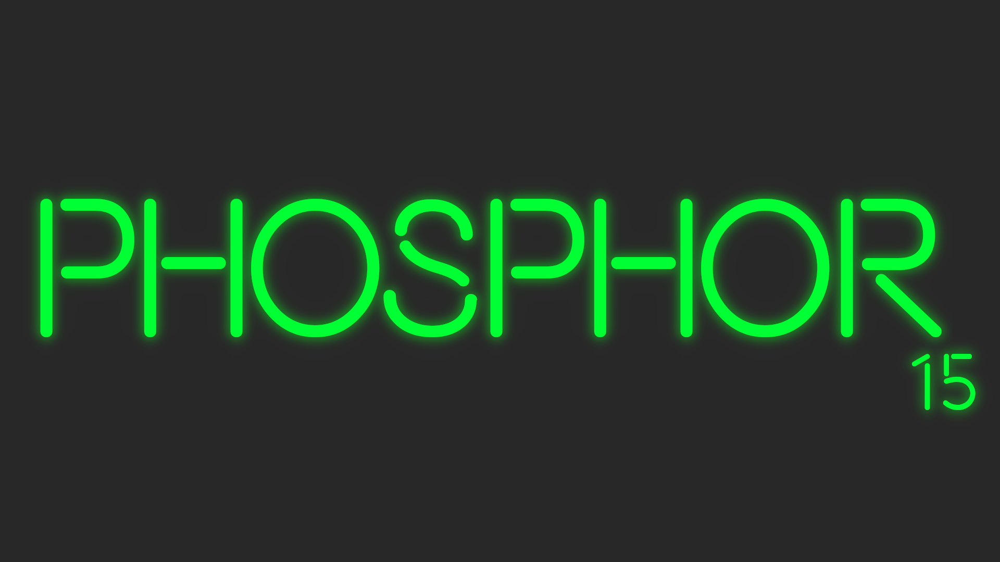

# Phosphor (p15)



Dart based Discord client API.

## For Developers

If you plan to work on this library, a `main.dart` test is set up for general purpose testing, further tests will be written in the future to actually test things. Also, to connect to discord with your own token: create a file called `config.json` in the `./test` directory and inside of it place:

```json
{"clientToken":"..."}
```

Where the `...` is the token for your bot. From there, all is good! Just make sure you have dart
installed and you should be able to build and run.
